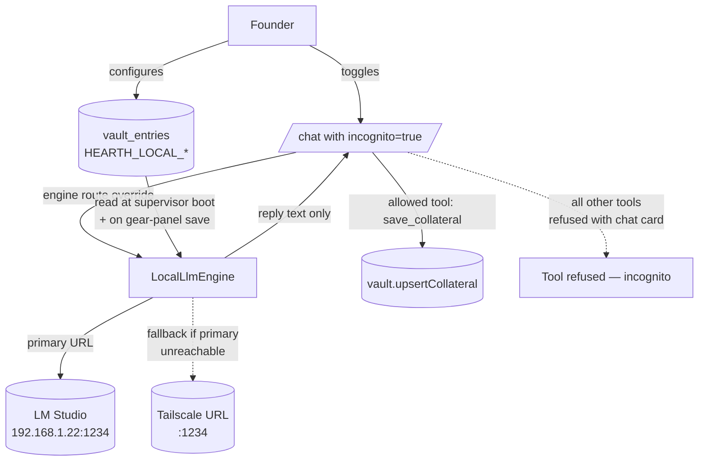

# `private_llm` — architecture

Marketplace skill that wires the founder's local LLM into Hearth's
incognito-chat surface and exposes a per-call `private_query` tool.
"Private" here means *off-cloud* — the model runs on hardware the
founder controls; nothing leaves the machine except the founder's
explicit save-to-collateral writes.

## Two boundaries it sits between

## URL configuration: primary + fallback

Two slots so a founder running LM Studio on a home machine can:

- Have `http://192.168.1.22:1234` as primary (LAN, fast)
- Have `http://hearth-mac.tailnet.ts.net:1234` as fallback (Tailscale, works
  away from home)

The engine probes the primary first. On connection refused or
timeout, it transparently retries against the fallback. If both fail,
the chat surface raises a clean error the founder can act on (no
silent fall-through to a cloud provider — the privacy contract is
non-negotiable).

**Port-default rule:** if a URL has no `:port`, Hearth assumes 1234
(LM Studio's default). Override by including the port literal —
e.g. `http://localhost:11434` for Ollama.

## Why `Private LLM` is gated as a marketplace skill

Two reasons:

1. **Explicit founder action**: until the founder installs + enables
   this skill, the chat's incognito toggle stays disabled. No accidental
   "I clicked it once and now my data leaks because the local engine
   isn't actually configured." Install proves the founder thought
   about it.

2. **Configurability through gear panel**: every other skill is
   configured the same way (vault inputs in a card, save in the gear
   panel). Engine config lived in `~/.hearth/.env` for the v0.1
   bootstrap; the skill manifest gives founders the standard surface.

## Allowed-tool policy while incognito is active

The chat surface enforces a hard allowlist when `incognito=true`:

| Tool | Allowed? | Why |
|---|---|---|
| `hearth_save_collateral` | ✅ | Pure on-device write; the only legitimate output channel |
| `web_search` / `web_fetch` | ❌ | Outbound network — defeats the privacy promise |
| `send_email` / `telegram_send` | ❌ | Sends content to a third party |
| `hearth_create_mission` | ❌ | Schedules cloud-engine work |
| `hearth_peer_*` (A2A) | ❌ | Already blocked by Phase 4.4 (defense in depth) |
| `private_query` (this skill) | ✅ | Self-reference is fine |

A refused tool returns a chat card explaining the refusal. The
agent's loop keeps going — it just can't reach for that capability
mid-incognito. The founder can disable incognito mid-thread to
unlock the full toolbelt.

## Resolution chain at the engine layer

Inside `LocalLlmEngine`, model selection follows the same order the
rest of Hearth uses:

1. `args.extraEnv.HEARTH_LOCAL_MODEL` (per-call from `private_query`)
2. `process.env.HEARTH_LOCAL_MODEL` (vault input or `~/.hearth/.env`)
3. `process.env.HEARTH_OLLAMA_MODEL` (legacy; honoured for compat)
4. Engine default (`llama3.3`)
5. Server-picks-loaded — when the server (LM Studio) accepts an
   empty model and uses whatever's loaded.

If the configured model isn't installed on the server, the engine
falls back to the first installed model and logs a warning rather
than failing the call. Avoids "ceremony picked Llama 3.3 but the
founder only loaded Qwen" surprise breakage.

## Failure modes

| Case | What happens |
|---|---|
| Both URLs unreachable | Chat returns `engine_unavailable: local llm offline`. Founder sees a clean error banner; no fallback to cloud. |
| Model not installed | Engine picks first installed; warns. Reply still flows. |
| Server returns 401 | When `HEARTH_LOCAL_API_KEY` is wrong/missing for OpenRouter etc. Reply is the 401 body so the founder can debug. |
| Server returns 5xx | One retry, then bubble error to the agent. |
| Ollama vs OpenAI mismatch | Wrong format selected → the engine's parser fails to extract content. Visible in supervisor logs as "no delta frames". Fix: switch the format dropdown in the gear panel. |

## What this skill does NOT do

- Persist model weights (those live on the founder's box, managed
  by their LLM server)
- Auto-discover a running local server (manual config — there are
  too many shapes to probe reliably)
- Multi-tenant / multi-user isolation (a Hearth instance is a
  founder's own box; the skill operates in that scope)

## v0.2 follow-ups

- Auto-detect format by probing `/api/tags` first, fall back to
  `/v1/models`
- Inline "test connection" button in the gear panel
- Per-thread default-incognito flag (some founders want certain
  topics always private)
- Health-check loop (poll every 30s; show the founder when the
  primary URL goes down + falls through)
- Encrypted full-audit retention as a Pro-tier add-on (today is
  Option B scrub)
